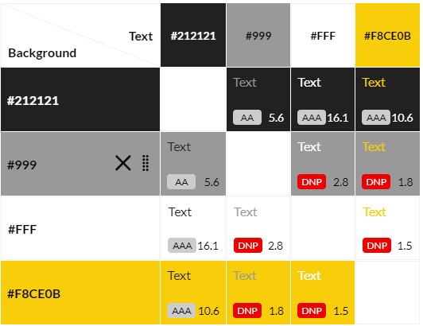

# **GameStar**

### **Table Of Contents**
Rather than reinventing the wheel, at the top of this section you will find a table of contents that is auto populated by GitHub.
This will remain fixed to the top, even when you scroll through the readme.

# **Project Overview**

The aim behind this project is to demonstrate my skills in the following areas:

* **Data handling**: Build a Relational Database backed Flask project for a web application that allows users to store and manipulate data records about a particular domain.

* **Database structure**: Design a database structure well-suited for my domain. Using relationships between records of different entities.

* **User functionality**: Create functionality for users to create, locate, display, edit and delete records (CRUD functionality).

* **Use of technologies**: Use HTML and custom CSS for the website's front-end, and Python for the back-end.

* **Structure**: Incorporate a main navigation menu and structured layout using Materialize.

* **Documentation**: Write a README.md file for your project that explains what the project does and the value that it provides to its users.

* **Version control**: Use Git & GitHub for version control.

* **Deployment**: Deploy the final version of your code to a hosting platform such as Heroku.

* **Testing**: Test and deploy frontend web application to a cloud platform.

---

# **User Experience (UX)** 

## **User Stories**:

* ### First Time Visitor Goals:
  * As a first time visitor, I want to easily understand the main purpose of the site.

  * As a first time visitor, I want to be able to navigate the site to find content easily.

  * As a first time visitor, I want to be able to create a new account.

  * As a first time visitor, I want to be able to look through the games, and read reviews left by other users.

* ### Returning Visitor Goals:
  * As a returning visitor, I want to find reviews on games I haven't played yet.

  * As a returning visitor, I want to leave reviews on games I have played.

  * As a returning visitor, I want to login to my user profile.

  * As a returning visitor, I want to view the reviews I have created.

  * As a returning visitor, I want to like reviews by other users.

* ### Frequent Visitor Goals:
  * As a frequent visitor, I want to update my review to reflect my view on the game since the last time the game was updated.

  * As a frequent visitor, I want to remove a review that I feel no longer applies to the game.

  * As a frequent visitor, I want to change my account password.

  * As a frequent visitor, I want to view all reviews a particular user has created.

  * As a returning visitor, I want to remove my like from a review.

  * As a frequent visitor, I want to delete my profile.

* ### Admin Goals:
  * As an Admin, I want to view a list of all registered users.

  * As an Admin, I want to view a list of all reviews created.

  * As an Admin, I want to remove a user.

  * As an Admin, I want to edit a review.

  * As an Admin, I want to remove a review.

  * As an Admin, I want to change my account password.

---

# **Frontend Design**

## **Colors**:

These are the main colors used throughout the project:

  *  `#212121`
  *  `#999`
  *  `#FFF`
  *  `#F8CE0B`

  A contrast grid was used to ensure that the contrast between background and foreground elements are compliant with WCAG 2.0 minimum contrast [Contrast Grid](https://contrast-grid.eightshapes.com/).

  

## **Typography**:
  * Two fonts are used throughout the project, Roboto is used for all main text. With Saira Stencil One being used for headings. Sans Serif as the fallback font in case for any reason the font is not being imported into the site correctly.

## **Imagery**:
  * Imagery is especially important in this project, the background image is used throughout the website, with the exception where a game is being displayed, and a game image is available.

# **Features**

### **Home Page**:

  This is the page that the user will be greeted with upon arriving at the site, and can be accessed at anytime by clicking either the **GameStar Logo** or **Home** link in the navigation bar/menu.
  
  This page will consist of a navigation bar/menu along the top, containing the GameStar logo, along with links to other pages within the web application, providing different links if the user is logged in, and if the user is Admin.

  Below the navigation bar/menu will be displayed the GameStar logo, tag line, and a paginated list of games that users have created reviews for.

  Finally at the bottom of the page will be the extended version of the footer.

  

### **Register Page**:

  This page will be available by clicking the **Register** link in the navigation bar/menu, and via various user prompts throughout the site.
  
  A user will be able to create a profile by choosing a username, and setting a password.

  If a user chooses a username that already exists, or the passwords entered do not match, they will be presented with the relevant error message.

  Once the user has registered they will be automatically logged in, and returned to the Home Page.

  

### **Log In Page**:

  This page will be available by clicking the **Login** link in the navigation bar/menu, and via various user prompts throughout the site.
  
  A user will be able to log in to a previously created user profile.

  If a user enters a username that does not exist, or the if password is incorrect, they will be presented with the relevant error message.

  Once the user has logged in, they will be redirected to the Home Page.

  

### **User Profile Page**:

  This page will be available by clicking the **Profile** link in the navigation bar/menu, allowing a user to change their password after first confirming their current password, followed by their new password and matching confirm password.

  

### **Manage Reviews Page**:

  This page will be available by clicking the **Manage Reviews** link in the navigation bar/menu.

  On this page a user with be greeted by one of two outcomes.

  1. If a user has not submitted any reviews, the page will display "You have not added any reviews yet". Followed by a prompt to add a review.

  2. If a user has submitted a review, this page will display a list of the reviews they have created, each opening a modal so that the user can view the review, while providing the user with the option to delete or edit their review.

  

### **Search Page**:

  This page will be available by clicking the add review link/button found on the home page if the user is logged in, or via the Manage Reviews page.

  Once loaded the user will be greeted with a search bar, allowing the user to enter the name of a game they wish to leave a review for.

  This will make a request to the IGDB api, returning a list of games matching the users search criteria.

  Each game returned from the api will generate a collapsible list containing the game cover art, game name and a summary of the game.

  Within the collapsible list the user will also find a button prompting them to add a review.

  

### **Add Review Page**:

  This page will be available by clicking the add review button found in the collapsible list of the relevant game from the Search Page.

  Once loaded the user will be greeted with a form asking them to give the game a rating, and give the review a heading, describe what they liked about the game, describe what they disliked about the game and how many hours they played the game.

  The user will be able to rate the game, by using a range slider that has a range between 0-5. When the user activates the slider, the user will also see that the "rating stars" will update dynamically with the value of the range slider.

  The user will then need to click the submit button in order for their review to be submitted. This will submit their review and return them to the home screen, displaying a message if the review has/not been successfully submitted.

  If the review was not successfully submitted, the user will be returned to the Add Review Page, with each field populated with what the user attempted to submit.

  

### **Game Review Page**:

  This page will be visible after a user selects to view reviews on a particular game, selected from the home page.

  At the top of the page there will be an image depicting the game cover art, a heading displaying the name of the game, followed by the official summary of the game.

  The user will then see a list of all the reviews created for the relevant game as a summary, displaying the review heading, the rating, the number of likes the review has, along with the username of the user that created the review and the date it was created.

  The user will be able to click on a review which renders a modal allowing the user to view the full review, and allow them to add/remove a like.

  If a user adds/removes their like, the like counter on the review is immediately updated, without the page reloading.

  Each review contains a link to the **User Reviews** page.

  There will also be buttons displayed to edit or delete the review, but these will only be visible to either the user that created the review, or the site Admin.

  

### **User Reviews Page**:

  This page will be visible after a user clicks on a username within a game review element.

  At the top of the page there will be a heading, "Reviews By" followed by the username of the selected user.

  Below the heading will be a list of all the reviews the selected user has created, containing a summary of the review, and a view button that renders a modal containing the full review.

  

### **Admin Pages**

  If the username of the logged in user is Admin, they will be presented with an Admin button in the nav bar/menu, that when clicked will provide two options.

  1. Users - This will direct the Admin to the User Manager page.
  2. Reviews - This will direct the Admin to the User Reviews page.

  

### **User Manager**
  This page will be only visible to the site Admin user.

  It will contain a list of all the registered users, displaying the username, along with a button to delete that particular user.

  There is also a Search Users input above the list of users, to aid in the Admin finding a particular username.

  

### **Review Manager**
  This page will be only visible to the site Admin user.

  It will contain a list of all the created reviews, displaying the username and game name, along with a button to view the full review, where there will be a further two buttons, one to edit the review, and the other to delete the review.  

  

## **Wireframes**
  To organize and streamline the development process, I created wireframes for the main pages of this project, to help me during the development process and to prevent scope creep.

  Below are links to each wireframe page of the project, created to cover both Mobile and Desktop versions.

### **Mobile Wireframes**:

  [Home Page](/doc/Wireframes/Mobile/Home.png)

  [Register](/doc/Wireframes/Mobile/Register.png)

  [Login](/doc/Wireframes/Mobile/Login.png)

  [User Profile](/doc/Wireframes/Mobile/User_Profile.png)

  [Manage Reviews No Reviews](/doc/Wireframes/Mobile/Manage_Reviews_No_Reviews_Found.png)

  [Manage Reviews](/doc/Wireframes/Mobile/Manage_Reviews.png)

  [Add Game](/doc/Wireframes/Mobile/Add_Game.png)

  [Add Review](/doc/Wireframes/Mobile/Add_Review.png)

  [Game Review](/doc/Wireframes/Mobile/Game_Review.png)

### **Desktop Wireframes**:

  [Home Page](/doc/Wireframes/Desktop/Home.png)

  [Register](/doc/Wireframes/Desktop/Register.png)

  [Login](/doc/Wireframes/Desktop/Login.png)

  [User Profile](/doc/Wireframes/Desktop/User_Profile.png)

  [Manage Reviews No Reviews](/doc/Wireframes/Desktop/Manage_Reviews_No_Reviews_Found.png)

  [Manage Reviews](/doc/Wireframes/Desktop/Manage_Reviews.png)

  [Add Game](/doc/Wireframes/Desktop/Add_Game.png)

  [Add Review](/doc/Wireframes/Desktop/Add_Review.png)

  [Game Review](/doc/Wireframes/Desktop/Game_Review.png)

---

# **Database Schema**
  
  Using drawSQL i created custom models, which I predicted would be required when building the website. 

  In order for users to create reviews custom user, game and review models are required, the user id will be used as a foreign key in the review model, along with the game id being used as a foreign key also in the review model.

  

  During development I made the decision to remove the dislike counter, as I felt this was redundant.

---

# **Technology**

## **Technologies Used**:
  * [HTML5](https://en.wikipedia.org/wiki/HTML5)
  * [CSS3](https://en.wikipedia.org/wiki/Cascading_Style_Sheets)
  * [JavaScript](https://en.wikipedia.org/wiki/JavaScript)
  * [Python](https://en.wikipedia.org/wiki/Python_(programming_language))
  * [PostgreSQL](https://en.wikipedia.org/wiki/PostgreSQL)

  Although I am capable of linking a Mongo DB to the project, there wasn't really a developmental need to do so, and in my opinion would be bad practice to include it just for the sake of including it.
  So for this reason I made the decision to not include a Non-Relational database, such as MongoDB.

  * [MongoDB](https://en.wikipedia.org/wiki/MongoDB)

## **Frameworks, Libraries and Programs Used**:

  1. [Google Fonts](https://fonts.google.com/):
    Google fonts was used to import the 'Roboto' & Saira Stencil One fonts into the style.css file which is used on all pages throughout the project.

  1. [Font Awesome](https://fontawesome.com/):
    Font Awesome was used on all pages throughout the website to add icons for aesthetic and UX purposes.

  1. [Git](https://git-scm.com/):
    Git was used for version control by utilizing the Gitpod terminal to commit to Git and Push to GitHub.

  1. [GitHub](https://github.com/):
    GitHub is used to store the projects code after being pushed from Git.

  1. [Balsamiq](https://balsamiq.com/):
    Balsamiq was used to create the wireframes during the design process.

  1. [GitPod](https://gitpod.io/):
    Open-source developer platform used for development.

  1. [MaterializeCSS](https://en.wikipedia.org/wiki/Material_Design):
    MaterializeCSS was used to help in constructing an attractive, consistent, and functional web page.

  1. [Flask](https://en.wikipedia.org/wiki/Flask_(web_framework)):
    Flask is a micro web framework written in Python.

  1. [SQLAlchemy](https://en.wikipedia.org/wiki/SQLAlchemy):
    SQLAlchemy is an open-source SQL toolkit and object-relational mapper (ORM) for the Python programming language

# **Testing**
  Testing has been documented separately, please see the Testing documentation linked below:

- [Testing Documentation](doc/TESTING.md)

# **Deployment**

  ### **Heroku**
  Before you can deploy your app to Heroku, initialize a local Git repository and commit your application code to it.

  #### **Create a Heroku Remote**
  Git remotes are versions of your repository that live on other servers. You deploy your app by pushing its code to a special Heroku-hosted remote that’s associated with your app.

  #### **For a New App**:

  The heroku create CLI command creates a new empty application on Heroku, along with an associated empty Git repository. If you run this command from your app’s root directory, the empty Heroku Git repository is automatically set as a remote for your local repository.

      heroku create -a gamestar-app

  You can use the "git remote -v" command to confirm that a remote named heroku has been set for your app.

  #### **For an Existing App**:

  Add a remote to your local repository with the heroku git:remote command. All you need is your Heroku app’s name:

      heroku git:remote -a gamestar-app

  #### **Deploy Your Code**:
  To deploy your app to Heroku, use the "git push" command to push the code from your local repository’s main branch to your heroku remote. For example:

      git push heroku main

  Use this same command whenever you want to deploy the latest committed version of your code to Heroku.

  Heroku only deploys code that you push to the master or main branches of the remote. Pushing code to another branch of the heroku remote has no effect.

  ---

  ### **Forking the GitHub Repository**
  By forking the GitHub Repository you make a copy of the original repository on your GitHub account to view and/or make changes without affecting the original repository.

  You can do this by completing the following steps:

  1. Log in to GitHub and locate the GitHub Repository
  1. At the top of the Repository (not top of page) just above the "Settings" Button on the menu, locate the "Fork" Button.
  1. You should now have a copy of the original repository in your GitHub account.

  ---

  ### **Making a Local Clone**:
  1. Log in to GitHub and locate the GitHub Repository
  1. Under the repository name, click "Clone or download".
  1. To clone the repository using HTTPS, under "Clone with HTTPS", copy the link.
  1. Open Git Bash
  1. Change the current working directory to the location where you want the cloned directory to be made.
  1. Type git clone, and then paste the URL you copied in Step 3.

    $ git clone https://github.com/Niki-Tester/gamestar.git
  

# **Link to deployed website**:
[Heroku - GameStar](https://gamestar-app.herokuapp.com/)